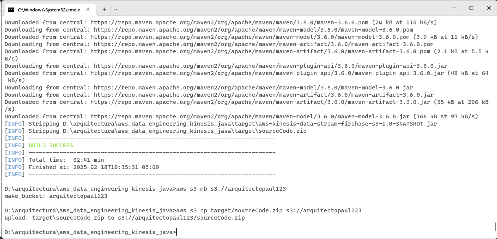
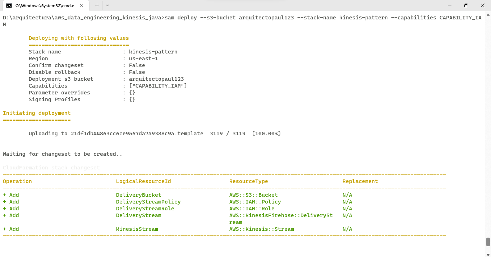
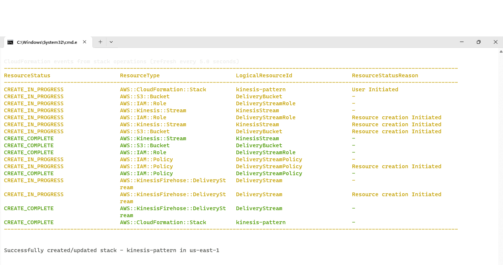
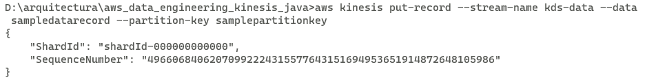
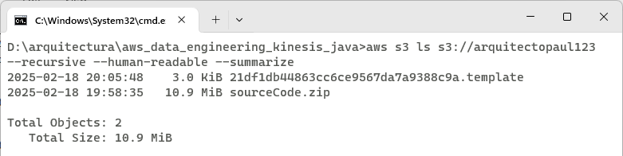
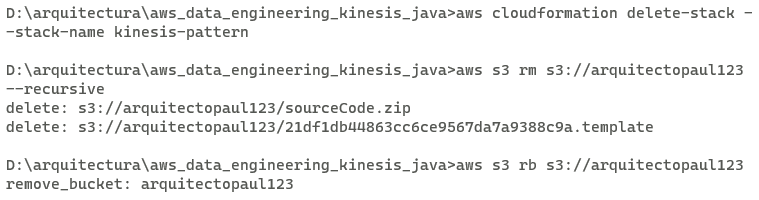

# AWS Kinesis Data Streams a Kinesis Data Firehose a S3


La plantilla AWS SAM despliega un AWS Kinesis Data Streams, un AWS Kinesis Data Firehose y un bucket S3.   
Este es un projecto Java.

## Costos
Important: esta aplicación utiliza varios servicios de AWS y hay costos asociados con estos servicios después del uso de la capa gratuita - puede consultar en [AWS Pricing page](https://aws.amazon.com/pricing/) for details. para conocer los costos con mayor detalle. Usted es responsable de los costos de AWS en los que se incurra. No hay ninguna garantía implícita en este ejemplo.

## Requisitos

* [Create an AWS account](https://portal.aws.amazon.com/gp/aws/developer/registration/index.html) Si aún no lo tiene, créelos e inicie sesión. El usuario de IAM que utilice debe tener permisos suficientes para realizar las llamadas de servicio de AWS necesarias y administrar los recursos de AWS.
* [AWS CLI](https://docs.aws.amazon.com/cli/latest/userguide/install-cliv2.html) debe estar instalado y configurado.
* [Git Installed](https://git-scm.com/book/en/v2/Getting-Started-Installing-Git)
* [AWS Serverless Application Model](https://docs.aws.amazon.com/serverless-application-model/latest/developerguide/serverless-sam-cli-install.html) (AWS SAM) installed

## Deployment Instructions

1. Compilar y empaquetar el código java utilizando Maven
    ``` 
    mvn clean package
    ```
   

1. Crear un bucket S3 donde el código fuente estará almacenado
    ```
    aws s3 mb s3://arquitectopaul123
    ```
1. Copiar el código fuente localizado en el folder target
    ```
    aws s3 cp target/sourceCode.zip s3://arquitectopaul123
    ```
   

1. Desplegar la pila CloudFormation
    ```
    sam deploy --s3-bucket arquitectopaul123 --stack-name kinesis-pattern --capabilities CAPABILITY_IAM
    ```
   
   
   

## Funcionamiento

Los registros capturados por Kinesis Data Streams son ingeridos por Kinesis Data Firehose y se almacenan como objetos en un bucket de S3. 

## Testing

Colocar un nuevo registro en Kinesis Data Streams
```
aws kinesis put-record --stream-name kds-data --data sampledatarecord --partition-key samplepartitionkey
```

   

Listar los objetos S3
```
aws s3 ls s3://arquitectopaul123 --recursive --human-readable --summarize
```
   

## Cleanup

```
aws cloudformation delete-stack --stack-name kinesis-pattern

aws s3 rm s3://arquitectopaul123 --recursive

aws s3 rb s3://arquitectopaul123
```
----

   

## Lenguaje de programación:
Escrito con Java 21.

## Framework

El framework utilizado para desplegar la infraestructura es SAM(AWS Serverless Application Model)
