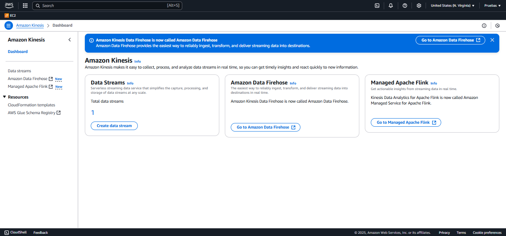

# AWS Kinesis Data Streams a Kinesis Data Firehose a S3


La plantilla AWS SAM despliega un AWS Kinesis Data Streams, un AWS Kinesis Data Firehose y un bucket S3.   
Este es un projecto Java. 
Si solo necesitas mover datos a S3 sin lógica personalizada → podrías usar Kinesis Firehose sin Java.
Pero si necesitas lógica de negocio, validaciones, filtros, transformaciones complejas… ahí entra Java.

Java se usa aquí para crear productores y consumidores de datos. Kinesis es como un "tubería de eventos", pero tú necesitas escribir:

🧪 1. Productor Java (Produce datos hacia Kinesis)
Un programa Java que genera eventos (por ejemplo, sensores, logs, datos aleatorios, etc.) y los envía a un stream de Kinesis usando el SDK de AWS.

PutRecordRequest request = new PutRecordRequest()
    .withStreamName("mi-stream")
    .withData(ByteBuffer.wrap("mensaje".getBytes()))
    .withPartitionKey("123");
kinesisClient.putRecord(request);
🔧 Este código es necesario porque Kinesis no genera datos por sí mismo. Tú decides qué enviar y cómo.

🧠 2. Consumidor Java (Lee y procesa datos del stream)
Otro programa (o Lambda escrita en Java) consume los datos desde el stream, y puede:
Procesarlos (ej: validación, transformación, enriquecimiento)
Guardarlos en base de datos, Elasticsearch, S3, etc.
Generar alertas, logs, analítica, etc.

RecordProcessor.processRecords(List<Record> records) {
  for (Record record : records) {
    String payload = new String(record.getData().array());
    // Lógica de negocio aquí
  }
}


## Costos
Important: esta aplicación utiliza varios servicios de AWS y hay costos asociados con estos servicios después del uso de la capa gratuita - puede consultar en [AWS Pricing page](https://aws.amazon.com/pricing/) for details. para conocer los costos con mayor detalle. Usted es responsable de los costos de AWS en los que se incurra. No hay ninguna garantía implícita en este ejemplo.

## Requisitos

* [Create an AWS account](https://portal.aws.amazon.com/gp/aws/developer/registration/index.html) Si aún no lo tiene, créelos e inicie sesión. El usuario de IAM que utilice debe tener permisos suficientes para realizar las llamadas de servicio de AWS necesarias y administrar los recursos de AWS.
* [AWS CLI](https://docs.aws.amazon.com/cli/latest/userguide/install-cliv2.html) debe estar instalado y configurado.
* [Git Installed](https://git-scm.com/book/en/v2/Getting-Started-Installing-Git)
* [AWS Serverless Application Model](https://docs.aws.amazon.com/serverless-application-model/latest/developerguide/serverless-sam-cli-install.html) (AWS SAM) installed

## Deployment Instructions

1. Compilar y empaquetar el código java utilizando Maven
    ``` 
    mvn clean package
    ```
   

1. Crear un bucket S3 donde el código fuente estará almacenado
    ```
    aws s3 mb s3://arquitectopaul123
    ```
   
   
   

1. Copiar el código fuente localizado en el folder target
    ```
    aws s3 cp target/sourceCode.zip s3://arquitectopaul123
    ```
   

1. Desplegar la pila CloudFormation
    ```
    sam deploy --s3-bucket arquitectopaul123 --stack-name kinesis-pattern --capabilities CAPABILITY_IAM
    ```
   
   
   

## Funcionamiento

Los registros capturados por Kinesis Data Streams son ingeridos por Kinesis Data Firehose y se almacenan como objetos en un bucket de S3. 

   

## Testing

Colocar un nuevo registro en Kinesis Data Streams
```
aws kinesis put-record --stream-name kds-data --data sampledatarecord --partition-key samplepartitionkey
```

   

   

   

Listar los objetos S3
```
aws s3 ls s3://arquitectopaul123 --recursive --human-readable --summarize
```
   

## Cleanup

```
aws cloudformation delete-stack --stack-name kinesis-pattern

aws s3 rm s3://arquitectopaul123 --recursive

aws s3 rb s3://arquitectopaul123
```
----

   

## Lenguaje de programación:
Escrito con Java 21.

## Framework

El framework utilizado para desplegar la infraestructura es SAM(AWS Serverless Application Model)
